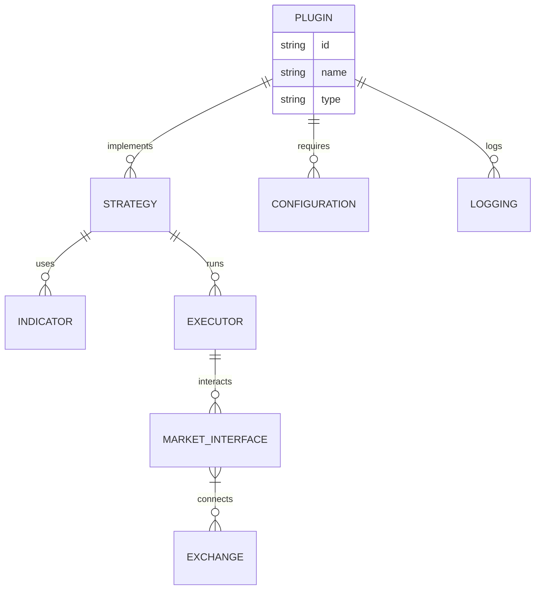

# VeighNa - By Traders, For Traders, AI-Powered.

<p align="center">
  
</p>

<p align="center">
    
    
    
    
    
</p>


## Why vnpy Plugins?
VeighNa is a Python-based open source quantitative trading system development framework that has grown step by step into a fully-featured quantitative trading platform with continuous contributions from the open source community. It currently has many users from domestic and international financial institutions, including hedge funds, investment banks, futures brokers, university research institutions, proprietary trading companies, etc.

:rocket: :rocket: :rocket: **The VeighNa Elite Quantitative Terminal for professional traders has been officially released, providing comprehensive support for professional traders' needs in areas such as massive strategy concurrency, intelligent position rolling, algorithmic order execution, multi-account trading support, and more. For more detailed information, please scan the QR code below and follow the account, then click on the menu bar's [Community Exchange -> Elite Member Services]**:

<p align="center">
  
</p>


They are:
- 🔌 Modular & reusable components
- 📦 Environment-agnostic (backtest, sandbox, live)
- 🧩 Easy to plug into any strategy or workflow
- 🌐 Exchange-agnostic with unified interfaces

Create, share, or combine plugins for indicators, strategies, risk controls, and more — all while keeping your code clean and scalable.


## AI-Powered

On the tenth anniversary of VeighNa's release, version 4.0 officially introduces the module targeting AI quantitative strategies, providing professional quantitative traders with **an all-in-one multi-factor machine learning (ML) strategy development, research, and live trading solution**:

<p align="center">
  
</p>

## vnpy Workspace

While the vnpy Platform is all about an integration to dozens of different data vendors, the interface is either Python or a CLI.

If you want an enterprise UI to visualize this datasets and use AI agents on top, you can find vnpy Workspace at.


* :bar_chart: **dataset**: Factor Feature Engineering

    * Designed specifically for ML algorithm training optimization, supporting efficient batch feature calculation and processing
    * Built-in rich factor feature expression calculation engine, enabling rapid one-click generation of training data
    * Alpha 158: A collection of stock market features from Microsoft's Qlib project, covering multiple dimensions of quantitative factors including K-line patterns, price trends, and time-series volatility

* :bulb: **model**: Prediction Model Training

    * Provides standardized ML model development templates, greatly simplifying model building and training processes
    * Unified API interface design, supporting seamless switching between different algorithms for performance comparison testing
    * Integrates multiple mainstream machine learning algorithms:
        * Lasso]: Classic Lasso regression model, implementing feature selection through L1 regularization
        * LightGBM: Efficient gradient boosting decision tree with a training engine optimized for large-scale datasets
        * MLP: Multi-layer perceptron neural network, suitable for modeling complex non-linear relationships


```python
import vnpy
"""
This example shows how backtest over tweets
"""

class TwitterBot(vnpy.Model):
    def main(self, args):
        while self.has_data:
            self.backtester.value_account()
            self.sleep('1h')

    def event(self, type_: str, data: str):
        # Now check if it's a tweet about Tesla
        if 'tsla' in data.lower() or 'gme' in data.lower():
            # Buy, sell or evaluate your portfolio
            pass


if __name__ == "__main__":
    exchange = vnpy.Alpaca()
    model = TwitterBot(exchange)

    # Add the tweets json here
    model.backtester.add_custom_events(vnpy.data.JsonEventReader('./tweets.json'))
    # Now add some underlying prices at 1 month
    model.backtester.add_prices('TSLA', '1h', start_date='3/20/22', stop_date='4/15/22')

    # Backtest or run live
    print(model.backtest(args=None, initial_values={'USD': 10000}))

```

**Shell** - the ready-made graphical framework with the ability to quickly change to your needs and with fully open source code in C#:
  - Complete source code
  - Support for all vnpy platform connections
  - Support for S#.Designer schemas
  - Flexible user interface
  - Strategy testing (statistics, equity, reports)
  - Save and load strategy settings
  - Launch strategies in parallel
  - Detailed information on strategy performance 
  - Launch strategies on schedule

## 🛠️ Installation

In addition to the graphical start-up method based on VeighNa Station, you can also create run.py in any directory and write the following sample code:

```Python
from vnpy.event import EventEngine
from vnpy.trader.engine import MainEngine
from vnpy.trader.ui import MainWindow, create_qapp

from vnpy_ctp import CtpGateway
from vnpy_ctastrategy import CtaStrategyApp
from vnpy_ctabacktester import CtaBacktesterApp


def main():
    """Start VeighNa Trader"""
    qapp = create_qapp()

    event_engine = EventEngine()
    main_engine = MainEngine(event_engine)
    
    main_engine.add_gateway(CtpGateway)
    main_engine.add_app(CtaStrategyApp)
    main_engine.add_app(CtaBacktesterApp)

    main_window = MainWindow(main_engine, event_engine)
    main_window.showMaximized()

    qapp.exec()


if __name__ == "__main__":
    main()
```




<p align="center">
    
</p>

<p align="center">
  </center>
</p>

## Contributors

 wouldn't be  without you. If we are going to disrupt financial industry, every contribution counts. Thank you for being part of this journey.

<a href="https://github.com/vnpy-finance/vnpy/graphs/contributors">
   
</a>
